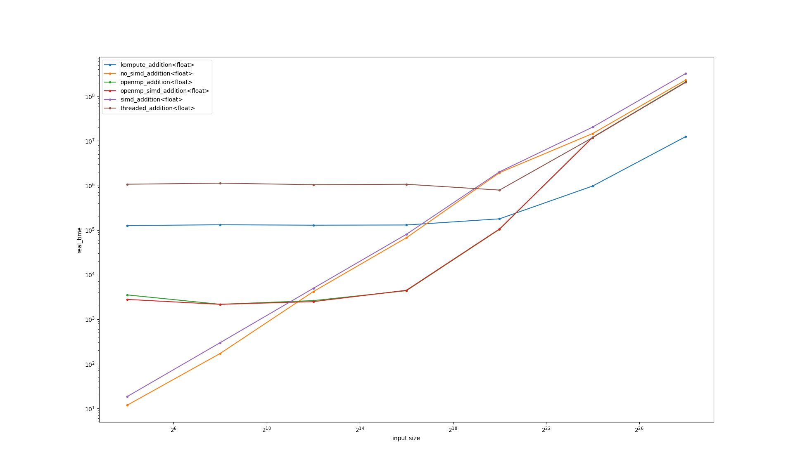
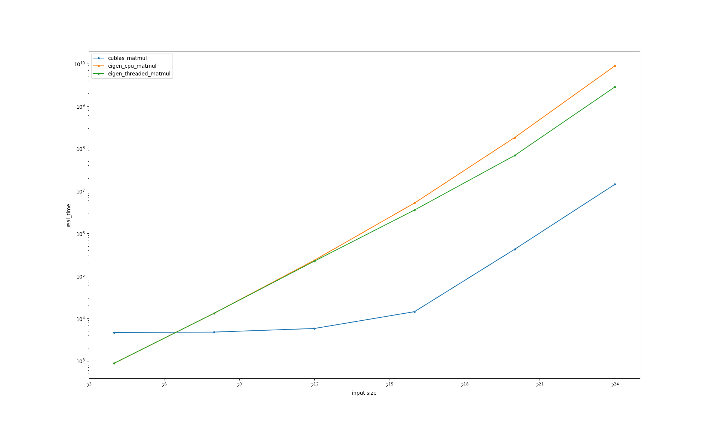

# FLOPS & Latency Benchmarks

This repo tries to answer the question "for a specific input size, and (simple) computation, which framework/accelerator should I choose?".

By implementing the same computation on all available frameworks/accelerators (CPU FPU baseline, SIMD, threads, GPU, FPGA, multi-machine, ...) and running with input sizes from 1 float to 1 billion (or more) floats, we'll see which framework is optimal for which input size.

Frameworks:
- [ ] FPU-only
- [x] SIMD compiler auto-vectorisation
- [ ] SIMD explicit vectorisation ([std::experimental::simd](https://en.cppreference.com/w/cpp/experimental/simd/simd)) (probably equivalent to [gcc/clang vector intrinsics](https://gcc.gnu.org/onlinedocs/gcc/Vector-Extensions.html))
- [x] OpenMP
- [x] [C++11 threads](https://en.cppreference.com/w/cpp/thread/thread)
- [x] GPU compute shaders via vulkan via [kompute](https://kompute.cc/)
- [ ] [Halide](https://halide-lang.org/)?
- [ ] [Kokkos](https://kokkos.github.io/kokkos-core-wiki/#)?
- FPGA?
- multi-machine stuff?
  - multi-machine threaded
  - multi-machine GPU
  - MPI
  - `std::execution::par_unseq`
  - https://developer.nvidia.com/blog/accelerating-standard-c-with-gpus-using-stdpar/

Similar projects
- https://github.com/ashvardanian/ParallelReductionsBenchmark

## Dependencies

```
sudo pacman -S \
    cmake clang \
    benchmark \
    python-matplotlib python-pandas \
    openmp \
    vulkan-tools vulkan-driver vulkan-headers glslang \
    eigen
```

## Running

```
./test.sh
```

## Example

For O(N) vector addition on specific hardware, this graph answers the question in the following way:
- for input size <= 2^8 floats, use CPU SIMD
- for input size between 2^12 and 2^20 floats, use OpenMP
- for input size >= 2^24 floats (and negligible device/host memory transfer cost) use the GPU



For O(N^3) matrix multiplication


